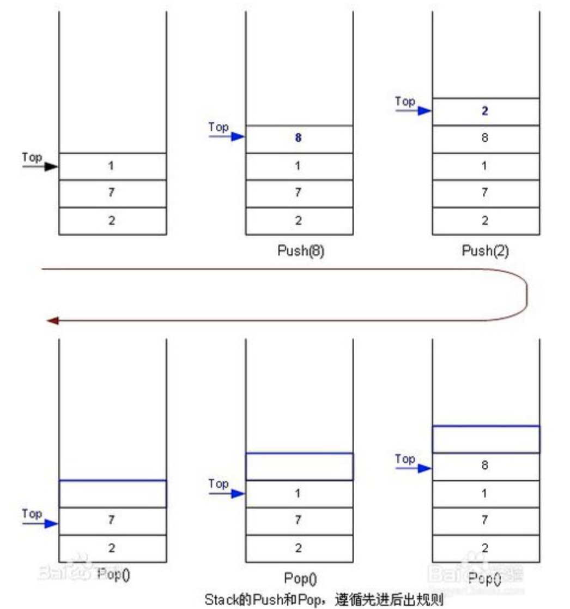

## 堆, 栈, 堆栈, 队列

### 1. 堆

**定义** 堆通常是一个可以被看做一棵树的数组对象   

#### 特点 
1. 堆中某个节点的值总是不大于或不小于其父节点的值
2. 堆总是一棵完全二叉树。
3. 堆是指程序运行时申请的动态内存，而栈只是指一种使用堆的方法(即先进后出)。

### 2.栈

**定义** 是一种运算受限的线性表

#### 特点
1. 仅允许在表的 **表头（又名栈顶）** 进行插入和删除运算，另一端称为**表尾（栈底）**
2. 先进后出 （好比蒸笼一层一层的，放在最下面的蒸笼的包子最后才能拿出来
3. 记忆功能，栈的特点是先进栈的后出栈，后进栈的先出栈，所以你对一个栈进行出栈操作，出来的元素肯定是你最后存入栈中的元素，所以栈有记忆功能。
4. 插入与删除时，不需要改变栈底指针。
5. 栈可以使用顺序存储也可以使用链式存储，栈也是线性表，因此线性表的存储结构对栈也适用

### 3.堆栈

**定义** 其实堆栈本身就是栈，只是换了个抽象的名字

#### 特点

1. 最后一个放入堆栈中的物体总是被最先拿出来， 这个特性通常称为后进先出(LIFO)队列。 
2. PUSH操作：在堆栈的顶部加入一个元素
3. POP操作：在堆栈顶部移去一个元素， 并将堆栈的大小减一。

### 堆栈区别

#### 1. 堆栈空间分配

 ① 栈（操作系统）：由操作系统自动分配释放 ，存放函数的参数值，局部变量的值等。其操作方式类似于数据结构中的栈。
 
 ② 堆（操作系统）： 一般由程序员分配释放， 若程序员不释放，程序结束时可能由OS回收，分配方式倒是类似于链表。
 
#### 2.堆栈缓存方式

 ① 栈使用的是一级缓存， 他们通常都是被调用时处于存储空间中，调用完毕立即释放。
  
 ② 堆则是存放在二级缓存中，生命周期由虚拟机的垃圾回收算法来决定（并不是一旦成为孤儿对象就能被回收）。所以调用这些对象的速度要相对来得低一些。
 
 
 
#### 3.堆栈数据结构区别

 ① 堆（数据结构）：堆可以被看成是一棵树，如：堆排序。

 ② 栈（数据结构）：一种先进后出的数据结构。

#### 4.队列

① 队列是一种特殊的线性表，只允许**前端（队尾）**（front）删除，而在**后端（队头）**（rear）插入。

② 队列中没有元素时，称为空队列。

③ 建立顺序队列结构必须为其静态分配或动态申请一片连续的存储空间，并设置两个指针进行管理。一个是队头指针front，它指向队头元素；另一个是队尾指针rear，它指向下一个入队元素的存储位置。

④ 队列采用的FIFO(first in first out)，新元素（等待进入队列的元素）总是被插入到链表的尾部，而读取的时候总是从链表的头部开始读取。每次读取一个元素，释放一个元素。所谓的动态创建，动态释放。因而也不存在溢出等问题。由于链表由结构体间接而成，遍历也方便。（先进先出）

### 堆、栈、队列之间的区别是？

① 堆是在程序运行时，而不是在程序编译时，申请某个大小的内存空间。即动态分配内存，对其访问和对一般内存的访问没有区别。

② 栈就是一个桶，后放进去的先拿出来，它下面本来有的东西要等它出来之后才能出来。（后进先出）

③ 队列只能在队头做删除操作,在队尾做插入操作.而栈只能在栈顶做插入和删除操作。（先进先出）

